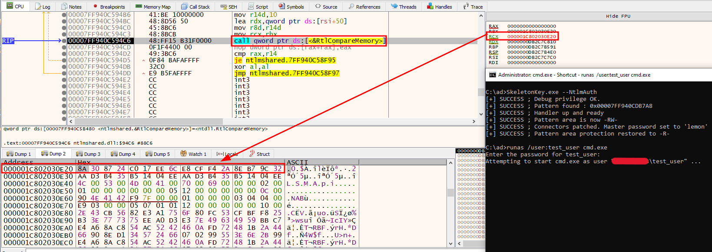

# SkeletonKey 💀
__Reproducing the Skeleton Key malware__

## Introduction
Skeleton Key is a 2015 piece of malware which particularly intrigued me during an autonomous research I was carrying out. [Mimikatz](https://github.com/gentilkiwi/mimikatz) is the only tool I found which already covers the technique. Apart from this, searching on the Internet only shows technical descriptions of the malware inner workings but no standalone code is provided. This repository contains this code.

## Usage
Injecting the Skeleton Key into lsass.exe is as easy as launching SkeletonKey.exe and selecting the preferred Windows authentication type to be patched.

```
Usage: SkeletonKey.exe {mode}

Modes:
--KerbAuth      patch Kerberos authentication
--NtlmAuth      patch NTLM authentication
```

## What is Skeleton Key?
Skeleton Key is a malware which was found by the [Dell SecureWorks Counter Threat Unit](https://www.secureworks.com/research/skeleton-key-malware-analysis) in 2015. The malware is an in-memory implant residing inside the lsass.exe process. It mainly tampers with the __Kerberos authentication__ mechanism by injecting a master password (skeleton key) in memory which can be used to authenticate as any user. The fun part is that the original password remains valid. To achieve this, the following steps are required:
- Downgrading algorithm from AES128/256 to RC4;
- Injecting custom handlers which validate the skeleton key against the typed password if the latter does not match the original password;
- Patching pointers to the original RC4 Initialize/Decrypt functions to be the new custom handlers.
More information about the inner working of the SkeletonKey can be found [here](https://www.virusbulletin.com/uploads/pdf/magazine/2016/vb201601-skeleton-key.pdf).

## Differences with the Mimikatz's implementation?
This code is a reimplementation of the Mimikatz's misc::skeleton command. However, it also includes NTLM patching other than just covering Kerberos.

### NTLM Patching
For systems which are not Kerberos-enabled and use NTLM authentication, the Skeleton Key carries out the following steps:
- Injecting a custom handler to replicate the MsvpPasswordValidate function (ntlmshared.dll) in order to validate the skeleton key against the typed password if the latter does not match the original password;
- Patching the pointer to MsvpPasswordValidate inside the Import Address Table of msv1_0.dll to be a pointer to the custom handler;


What happens is that lsass will call our custom MsvpPasswordValidate instead of the real version. The most relevant part of MsvpPasswordValidate is the following call to RtlCompareMemory, which indeed compares the hashed version of the password typed by the user with the hash inside the Security Account Manager (SAM). 


The custom handler replaces the latter with the hash of the Skeleton Key.




## References
- https://www.virusbulletin.com/uploads/pdf/magazine/2016/vb201601-skeleton-key.pdf
- https://github.com/gentilkiwi/mimikatz
